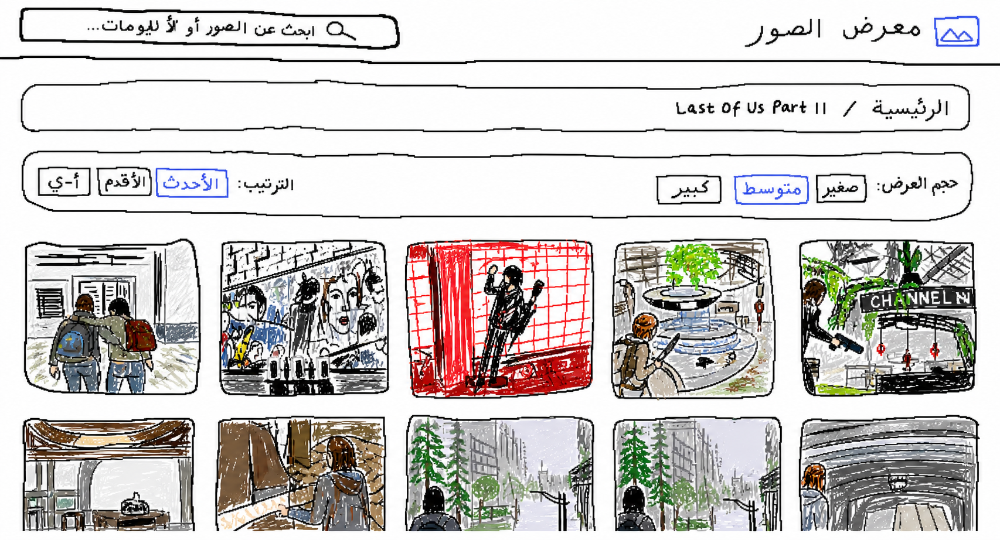
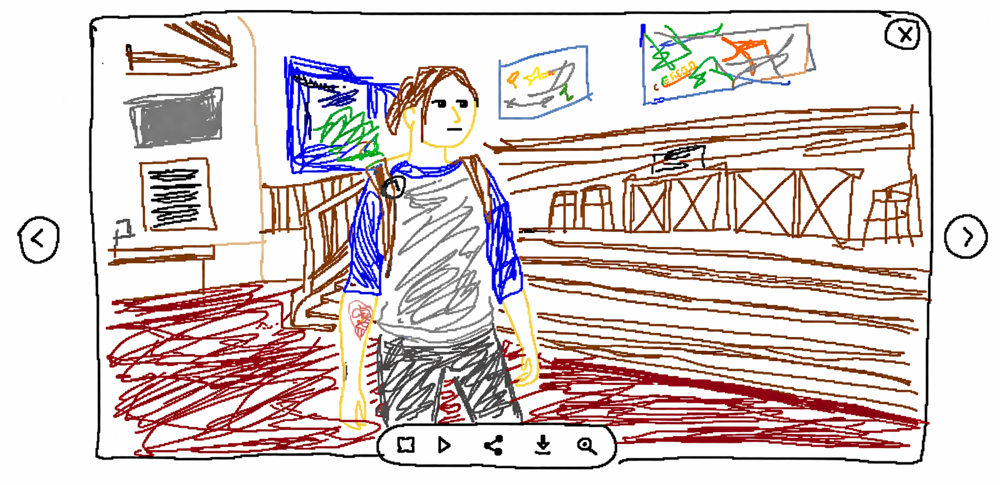

# 🖼️ Professional Photo Gallery | معرض الصور الاحترافي

<div align="center">


[English](#english) | [العربية](#arabic)

</div>

---

<a name="english"></a>
## 🌟 English

### 📝 Description

A modern, fast, and secure PHP photo gallery with a stunning dark theme interface. Built with performance and user experience in mind, featuring instant image loading, Arabic language support, and advanced security measures.

### ✨ Key Features

#### 🚀 Performance
- **Instant Preview Loading** - Thumbnails appear immediately when clicking on images
- **Progressive Image Loading** - Shows low-quality preview first, then loads full quality
- **Smart Caching System** - 3-tier caching (thumbnails, previews, full images)
- **Lazy Loading** - Images load only when visible
- **Preloading Adjacent Images** - Next/previous images load in background

#### 🎨 Design & UX
- **Modern Dark Theme** - Eye-friendly dark interface with accent colors
- **Fully Responsive** - Works perfectly on all devices
- **Smooth Animations** - Elegant transitions and effects
- **Advanced Lightbox** - With zoom, pan, slideshow features
- **Grid Size Options** - Small, medium, large grid layouts
- **Search Functionality** - Real-time search for albums and images

#### 🌍 Internationalization
- **Full Arabic Support** - Complete RTL layout
- **Unicode Filenames** - Supports Arabic, English, and special characters
- **Bilingual Interface** - Easy to switch between languages

#### 🔒 Security
- **Path Traversal Protection** - Prevents directory access attacks
- **File Type Validation** - Only allows safe image formats
- **CSRF Protection** - Token-based form protection
- **Rate Limiting** - Prevents abuse (1000 requests/minute)
- **XSS Protection** - Input sanitization and output encoding
- **Content Security Policy** - Advanced browser security headers

#### 🎮 Lightbox Features
- **Pinch to Zoom** - Mobile gesture support
- **Keyboard Navigation** - Arrow keys, ESC, spacebar controls
- **Touch Gestures** - Swipe to navigate on mobile
- **Fullscreen Mode** - F key or button
- **Download Images** - D key or button
- **Share Functionality** - Native share API support
- **Slideshow Mode** - Auto-play with customizable timing

### 📋 Requirements

- **PHP 7.4** or higher
- **GD Library** for image processing
- **Apache/Nginx** web server
- **Write permissions** for cache directory

### 🛠️ Installation

1. **Clone or download the repository**
```bash
git clone https://github.com/a9ii/gallery.git
cd gallery
```

2. **Create required directories**
```bash
mkdir -p albums
mkdir -p cache/thumbs
chmod 755 albums
chmod 755 cache/thumbs
```

3. **Configure your web server**

For **Apache** (.htaccess):
```apache
RewriteEngine On
RewriteCond %{REQUEST_FILENAME} !-f
RewriteCond %{REQUEST_FILENAME} !-d
RewriteRule ^(.*)$ index.php [QSA,L]
```

For **Nginx**:
```nginx
location / {
    try_files $uri $uri/ /index.php?$query_string;
}
```

4. **Place the PHP file**
- Rename the main file to `index.php`
- Place it in your web root directory

### 📂 Directory Structure

```
photo-gallery/
├── index.php           # Main application file
├── albums/            # Your photo albums
│   ├── Album 1/       # Album folder (any name)
│   │   ├── cover.jpg  # Optional album cover
│   │   ├── photo1.jpg
│   │   └── photo2.png
│   └── Album 2/
│       ├── image1.webp
│       └── image2.jpg
├── cache/             # Auto-generated cache
│   └── thumbs/        # Thumbnail cache
└── README.md          # This file
```

### 🚀 Usage

1. **Create Albums**
   - Create folders inside `albums/` directory
   - Folder names become album names
   - Supports spaces and special characters

2. **Add Photos**
   - Place images inside album folders
   - Supported formats: JPG, PNG, WebP, GIF, AVIF
   - Max file size: 50MB per image

3. **Set Album Cover** (Optional)
   - Add `cover.jpg` to album folder
   - Otherwise, first image is used

4. **Access Gallery**
   - Navigate to your domain
   - Albums appear automatically
   - Click album to view images

### ⚙️ Configuration

Edit these constants in `index.php`:

```php
// Security
define('ENABLE_RATE_LIMIT', true);        // Enable/disable rate limiting
define('RATE_LIMIT_MAX_REQUESTS', 1000);  // Max requests per window
define('RATE_LIMIT_TIME_WINDOW', 60);     // Time window in seconds

// Images
define('DEFAULT_THUMB_WIDTH', 520);       // Default thumbnail width
define('MIN_THUMB_WIDTH', 120);           // Minimum thumbnail width
define('MAX_THUMB_WIDTH', 2000);          // Maximum thumbnail width
define('ALLOWED_EXTS', ['jpg', 'jpeg', 'png', 'webp', 'avif', 'gif']);

// Site Info
define('SITE_NAME', 'معرض الصور');        // Gallery name
define('SITE_DESC', 'معرض صور احترافي');   // Gallery description
```

### ⌨️ Keyboard Shortcuts

| Key | Action |
|-----|--------|
| `←` / `→` | Navigate images |
| `ESC` | Close lightbox |
| `Space` | Play/pause slideshow |
| `F` | Toggle fullscreen |
| `Z` | Toggle zoom |
| `D` | Download image |
| `+` / `-` | Zoom in/out |

### 🔧 Troubleshooting

| Issue | Solution |
|-------|----------|
| **Images not showing** | Check folder permissions (755) |
| **Slow loading** | Enable GD library in PHP |
| **Rate limit error** | Wait 60 seconds or increase limit |
| **Arabic text issues** | Ensure UTF-8 encoding |
| **Cache not working** | Check write permissions on cache/ |

---

<a name="arabic"></a>
## 🌟 العربية

### 📝 الوصف

معرض صور PHP حديث وسريع وآمن مع واجهة داكنة مذهلة. تم بناؤه مع التركيز على الأداء وتجربة المستخدم، يتميز بتحميل فوري للصور، دعم كامل للغة العربية، وإجراءات أمان متقدمة.

### ✨ المميزات الرئيسية

#### 🚀 الأداء
- **تحميل فوري للمعاينة** - تظهر المصغرات فوراً عند النقر على الصور
- **تحميل تدريجي للصور** - عرض معاينة منخفضة الجودة أولاً، ثم تحميل الجودة الكاملة
- **نظام تخزين مؤقت ذكي** - تخزين مؤقت ثلاثي المستويات
- **التحميل الكسول** - تحميل الصور فقط عند الظهور
- **التحميل المسبق للصور المجاورة** - تحميل الصور التالية/السابقة في الخلفية

#### 🎨 التصميم وتجربة المستخدم
- **ثيم داكن عصري** - واجهة داكنة مريحة للعين
- **استجابة كاملة** - يعمل بشكل مثالي على جميع الأجهزة
- **حركات سلسة** - انتقالات وتأثيرات أنيقة
- **عارض متقدم** - مع ميزات التكبير والسحب وعرض الشرائح
- **خيارات حجم الشبكة** - تخطيطات شبكة صغيرة ومتوسطة وكبيرة
- **وظيفة البحث** - بحث فوري عن الألبومات والصور

#### 🌍 التدويل
- **دعم كامل للعربية** - تخطيط RTL كامل
- **أسماء ملفات يونيكود** - يدعم العربية والإنجليزية والأحرف الخاصة
- **واجهة ثنائية اللغة** - سهولة التبديل بين اللغات

#### 🔒 الأمان
- **حماية من Path Traversal** - منع هجمات الوصول للمجلدات
- **التحقق من نوع الملف** - السماح فقط بصيغ الصور الآمنة
- **حماية CSRF** - حماية النماذج بالرموز المميزة
- **تحديد معدل الطلبات** - منع الإساءة (1000 طلب/دقيقة)
- **حماية XSS** - تعقيم المدخلات وترميز المخرجات
- **سياسة أمان المحتوى** - رؤوس أمان متقدمة للمتصفح

#### 🎮 مميزات العارض
- **القرص للتكبير** - دعم إيماءات الهاتف
- **التنقل بلوحة المفاتيح** - أسهم، ESC، مسافة
- **إيماءات اللمس** - السحب للتنقل على الهاتف
- **وضع ملء الشاشة** - مفتاح F أو زر
- **تحميل الصور** - مفتاح D أو زر
- **وظيفة المشاركة** - دعم واجهة المشاركة الأصلية
- **وضع عرض الشرائح** - تشغيل تلقائي مع توقيت قابل للتخصيص

### 📋 المتطلبات

- **PHP 7.4** أو أعلى
- **مكتبة GD** لمعالجة الصور
- **خادم Apache/Nginx**
- **صلاحيات الكتابة** لمجلد التخزين المؤقت

### 🛠️ التثبيت

1. **استنساخ أو تحميل المستودع**
```bash
git clone https://github.com/a9ii/gallery.git
cd gallery
```

2. **إنشاء المجلدات المطلوبة**
```bash
mkdir -p albums
mkdir -p cache/thumbs
chmod 755 albums
chmod 755 cache/thumbs
```

3. **إعداد خادم الويب**

لـ **Apache** (.htaccess):
```apache
RewriteEngine On
RewriteCond %{REQUEST_FILENAME} !-f
RewriteCond %{REQUEST_FILENAME} !-d
RewriteRule ^(.*)$ index.php [QSA,L]
```

لـ **Nginx**:
```nginx
location / {
    try_files $uri $uri/ /index.php?$query_string;
}
```

4. **وضع ملف PHP**
- أعد تسمية الملف الرئيسي إلى `index.php`
- ضعه في مجلد الويب الرئيسي

### 📂 هيكل المجلدات

```
photo-gallery/
├── index.php           # الملف الرئيسي للتطبيق
├── albums/            # ألبومات الصور
│   ├── ألبوم العائلة/  # مجلد الألبوم (أي اسم)
│   │   ├── cover.jpg  # غلاف الألبوم (اختياري)
│   │   ├── صورة1.jpg
│   │   └── صورة2.png
│   └── رحلة الصيف/
│       ├── image1.webp
│       └── image2.jpg
├── cache/             # التخزين المؤقت التلقائي
│   └── thumbs/        # تخزين المصغرات
└── README.md          # هذا الملف
```

### 🚀 الاستخدام

1. **إنشاء الألبومات**
   - أنشئ مجلدات داخل مجلد `albums/`
   - أسماء المجلدات تصبح أسماء الألبومات
   - يدعم المسافات والأحرف الخاصة والعربية

2. **إضافة الصور**
   - ضع الصور داخل مجلدات الألبومات
   - الصيغ المدعومة: JPG, PNG, WebP, GIF, AVIF
   - الحد الأقصى: 50 ميجابايت لكل صورة

3. **تعيين غلاف الألبوم** (اختياري)
   - أضف `cover.jpg` إلى مجلد الألبوم
   - وإلا سيتم استخدام أول صورة

4. **الوصول للمعرض**
   - انتقل إلى نطاقك
   - تظهر الألبومات تلقائياً
   - انقر على الألبوم لعرض الصور

### ⚙️ الإعدادات

عدّل هذه الثوابت في `index.php`:

```php
// الأمان
define('ENABLE_RATE_LIMIT', true);        // تفعيل/تعطيل تحديد المعدل
define('RATE_LIMIT_MAX_REQUESTS', 1000);  // الحد الأقصى للطلبات
define('RATE_LIMIT_TIME_WINDOW', 60);     // النافذة الزمنية بالثواني

// الصور
define('DEFAULT_THUMB_WIDTH', 520);       // عرض المصغر الافتراضي
define('MIN_THUMB_WIDTH', 120);           // الحد الأدنى لعرض المصغر
define('MAX_THUMB_WIDTH', 2000);          // الحد الأقصى لعرض المصغر
define('ALLOWED_EXTS', ['jpg', 'jpeg', 'png', 'webp', 'avif', 'gif']);

// معلومات الموقع
define('SITE_NAME', 'معرض الصور');        // اسم المعرض
define('SITE_DESC', 'معرض صور احترافي');   // وصف المعرض
```

### ⌨️ اختصارات لوحة المفاتيح

| المفتاح | الإجراء |
|---------|---------|
| `←` / `→` | التنقل بين الصور |
| `ESC` | إغلاق العارض |
| `مسافة` | تشغيل/إيقاف عرض الشرائح |
| `F` | تبديل ملء الشاشة |
| `Z` | تبديل التكبير |
| `D` | تحميل الصورة |
| `+` / `-` | تكبير/تصغير |

### 🔧 حل المشاكل

| المشكلة | الحل |
|---------|------|
| **الصور لا تظهر** | تحقق من صلاحيات المجلد (755) |
| **تحميل بطيء** | فعّل مكتبة GD في PHP |
| **خطأ تحديد المعدل** | انتظر 60 ثانية أو ارفع الحد |
| **مشاكل النص العربي** | تأكد من ترميز UTF-8 |
| **التخزين المؤقت لا يعمل** | تحقق من صلاحيات الكتابة على cache/ |

---

## 📸 Screenshots | لقطات الشاشة

### Home Page | الصفحة الرئيسية
<div align="center">

</div>

### Album View | عرض الألبوم
<div align="center">

</div>

### Lightbox | العارض
<div align="center">

</div>

---

## 🤝 Contributing | المساهمة

Contributions are welcome! Please feel free to submit a Pull Request.

المساهمات مرحب بها! لا تتردد في إرسال Pull Request.

## 📄 License | الترخيص

This project is licensed under the MIT License - see the [LICENSE](LICENSE) file for details.

هذا المشروع مرخص بموجب رخصة MIT - انظر ملف [LICENSE](LICENSE) للتفاصيل.

## 🙏 Credits | الشكر

- Icons: Material Design Icons
- Font: Tajawal (Google Fonts)
- Inspiration: Modern gallery designs


<div align="center">
Made with ❤️
</div>
